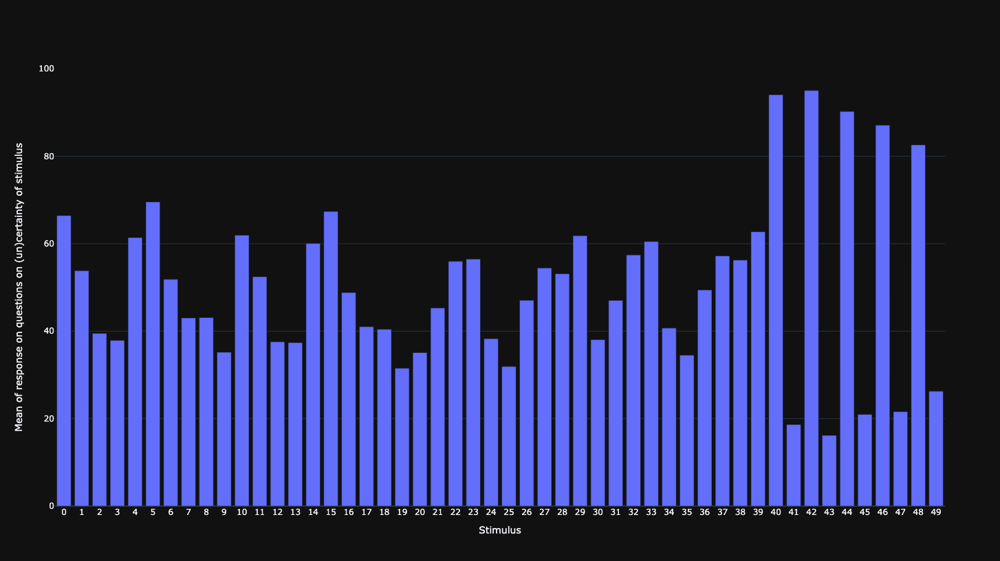
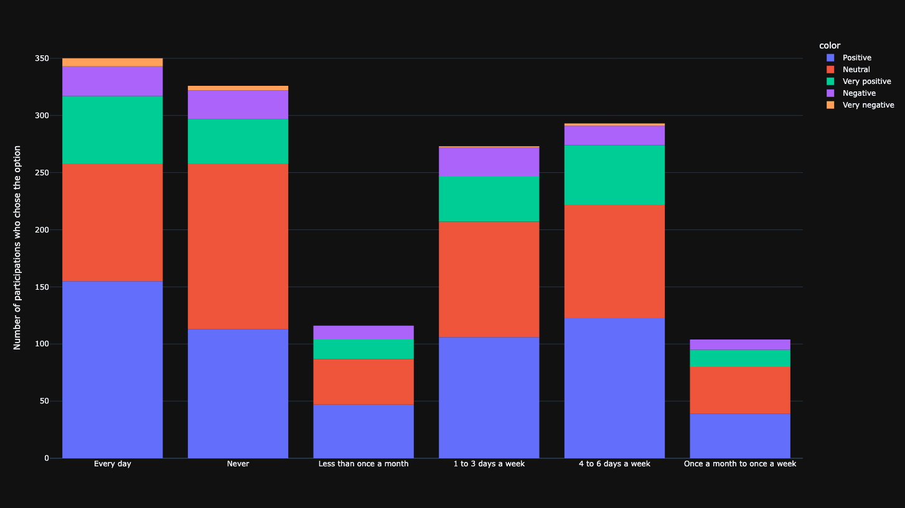
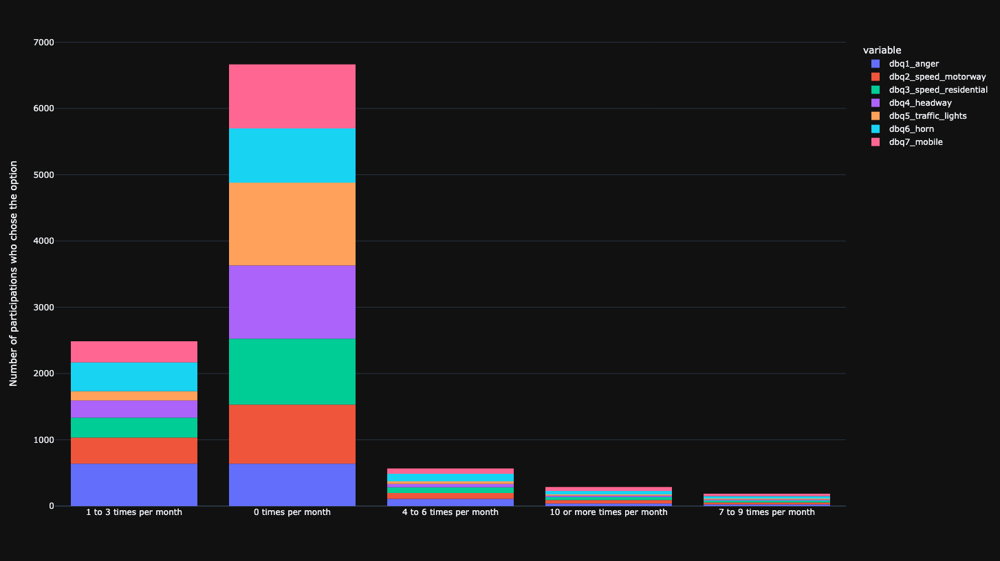
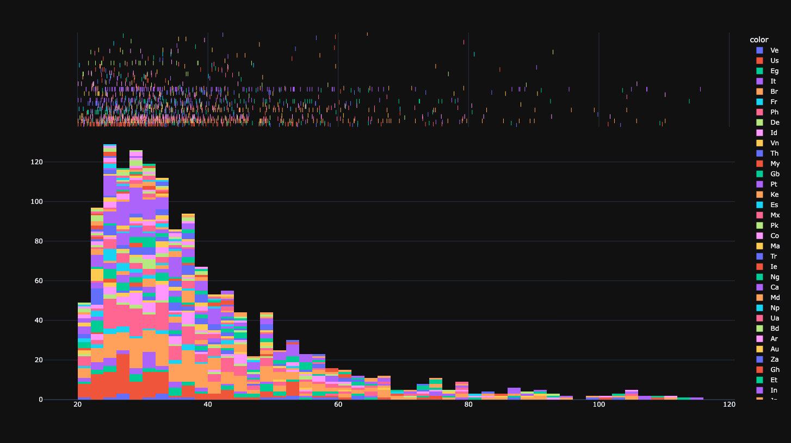
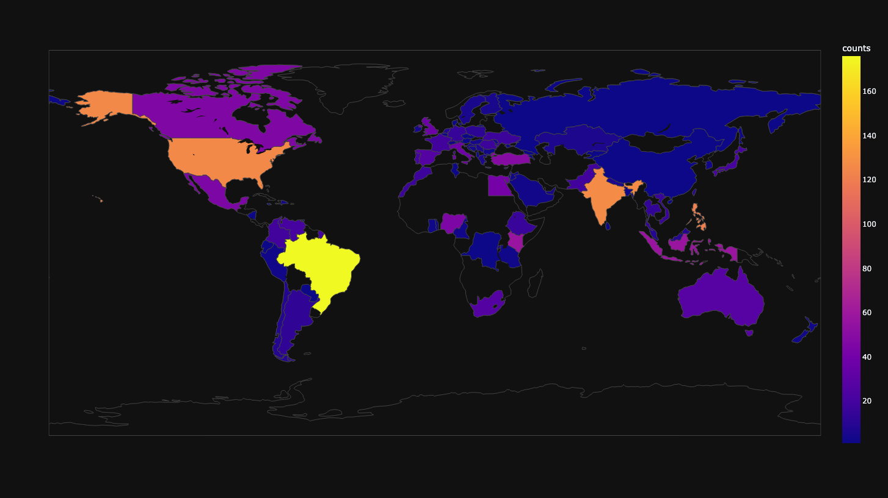
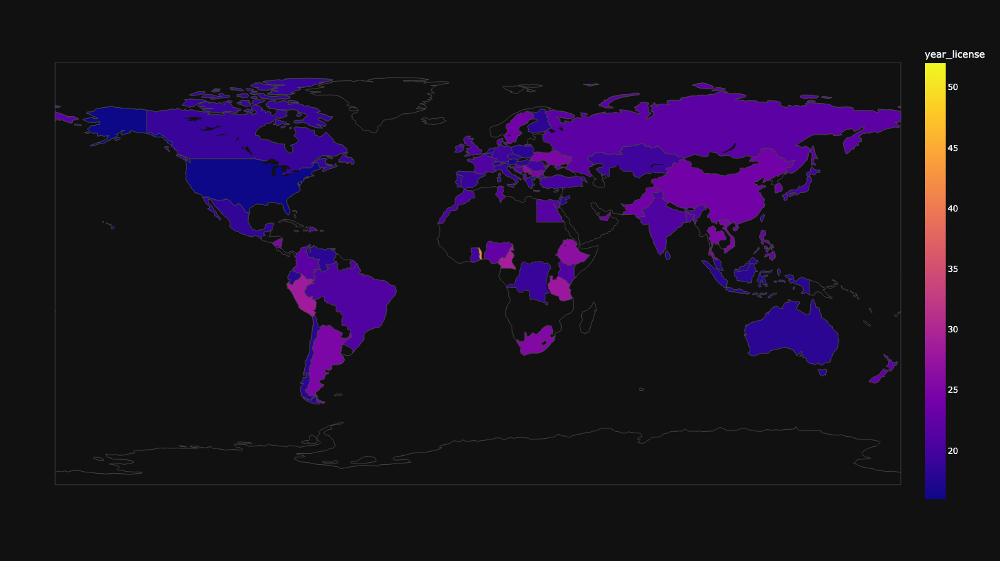
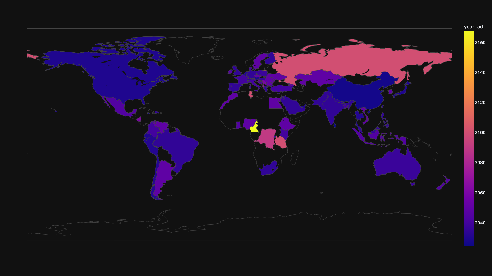
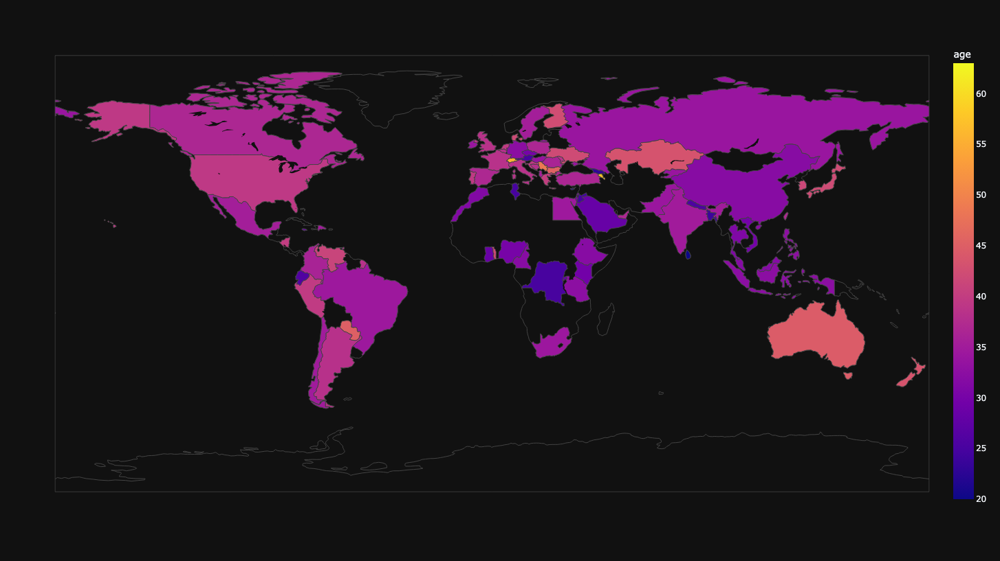
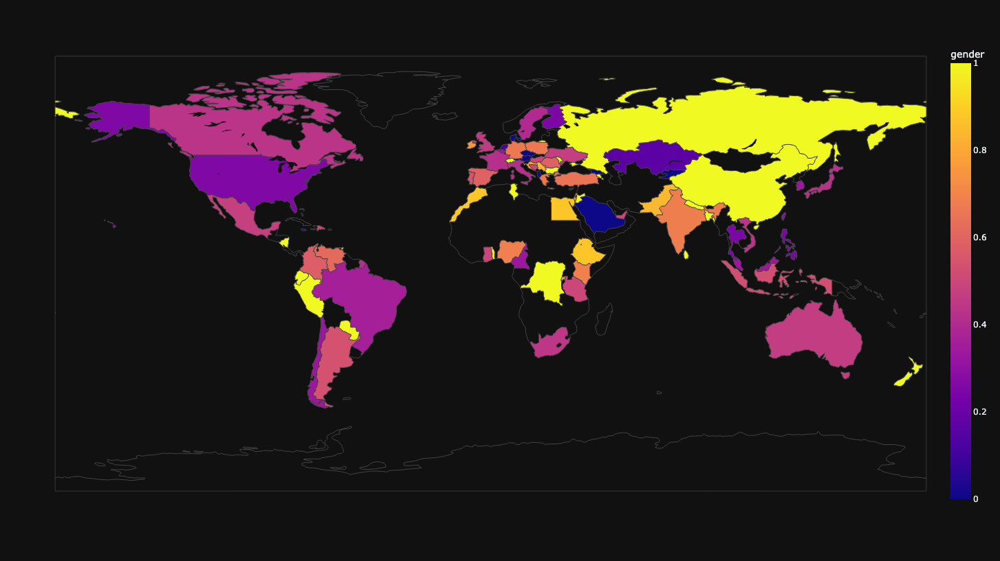
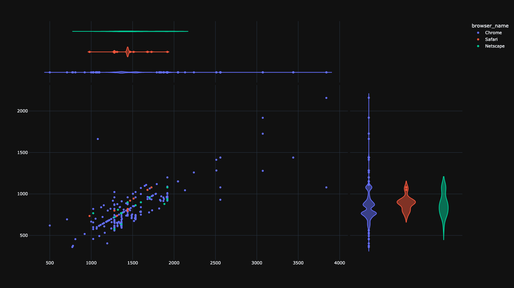

# Analysing relationship between certainty and uncertainty

This project defines a framework for the analysis of certainty and uncertainty. The jsPsych framework is used to for the frontend. In the description below, it is assumed that the repo is stored in the folder `uncertainty-crowdsourced`. Terminal commands lower assume macOS.

## Setup
Tested with Python 3.9.12. To setup the environment run these two commands in a parent folder of the downloaded repository (replace `/` with `\` and possibly add `--user` if on Windows):
- `pip install -e uncertainty-crowdsourced` will setup the project as a package accessible in the environment.
- `pip install -r uncertainty-crowdsourced/requirements.txt` will install required packages.

For QA, the API key of appen needs to be placed in file `uncertainty-crowdsourcing/secret`. The file needs to be formatted as `uncertainty-crowdsourcing/secret example`.

## Implementation on heroku
We use [heroku](https://www.heroku.com) to host the node.js implementation. The demo of the implementation may be viewed [here](https://uncertainty-crowdsourced-fc75d40fe544.herokuapp.com/?debug=true&save_data=false). Implementation supports images and/or videos as stimuli.

## Measuring perceived risk
In this crowdsourcing survey, participants were presented with 20 video and 4 image stimuli (see below for examples). The participants had to report how certain or uncertain they felt about the stimuli.

.
An example of one of the videos included in the crowdsourcing survey.

.
Stimulus `image_0` included in the crowdsourcing survey.

.
Stimulus `image_1` included in the crowdsourcing survey.

.
Stimulus `image_2` included in the crowdsourcing survey.

.
Stimulus `image_3` included in the crowdsourcing survey.

## Crowdsourcing job on appen
We use [appen](http://appen.com) to run a crowdsourcing job. You need to create a client account to be able to create a launch crowdsourcing job. Preview of the appen job used in this experiment is available [here](https://github.com/bazilinskyy/uncertainty-crowdsourcing/blob/main/public/appen/survey.pdf?raw=true).

### Filtering of appen data
Data from appen is filtered based on the following criteria:
1. People who did not read instructions.
1. People who did not give consent.
2. People who are younger than 18 years of age.
3. People who completed the study in under `config.allowed_min_time`.
4. People who completed the study from the same IP more than once (the 1st data entry is retained).
5. People who used the same `worker_code` multiple times. One of the disadvantages of crowdsourcing is having to deal with workers that accept and do crowdsourcing jobs just for money (i.e., `cheaters`). The framework offers filtering mechanisms to remove data from such people from the dataset used for the analysis. Cheaters can be reported from the `uncert.analysis.QA` class. It also rejects rows of data from cheaters in appen data and triggers appen to acquire more data to replace the filtered rows.

### Anonymisation of data
Data from appen is anonymised in the following way:
1. IP addresses are assigned to a mask starting from `0.0.0.0` and incrementing by 1 for each unique IP address (e.g., the 257th IP address would be masked as `0.0.0.256`).
2. IDs are anonymised by subtracting the given ID from `config.mask_id`.

## Analysis
Analysis can be started by running `python uncertainty-crowdsourcing/uncert/run.py`. A number of CSV files used for data processing are saved in `uncertainty-crowdsourcing/_output`. Visualisations of all data are saved in `uncertainty-crowdsourcing/_output/figures/`.

### Visualisation
All static figures below link to their corresponding dynamic and clickable versions in html format.

#### Correlation and scatter matrices

Correlation matrix on stimulus level.

  
Scatter matrix on stimulus level.

Correlation matrix on participant level.

  
Scatter matrix on participant level.

#### Uncertainty
  
Scores of uncertainty.

#### Information on participants
  
Driving frequency.

  
Driving behaviour questionnaire (DBQ).

  
Time of participation.

  
Map of counts of participants.

  
Map of years of having a license.

  
Map of prediction of the year of introduction of automated cars in the country of residence.

  
Map of age of participants.

  
Map of distribution of gender.

#### Technical characteristics of participants
  
Dimensions of browser.

### Configuration of project
Configuration of the project needs to be defined in `uncertainty-crowdsourced/config`. Please use the `default.config` file for the required structure of the file. If no custom config file is provided, `default.config` is used. The config file has the following parameters:
* `appen_job`: ID of the appen job.
* `num_stimuli_video`: number of video stimuli.
* `num_stimuli_img`: number of image stimuli.
* `num_stimuli_repeat`: number of repetitions for each stimulus.
* `allowed_min_time`: the cut-off for minimal time of participation for filtering.
* `num_repeat`: number of times each stimulus is repeated.
* `mask_id`: number for masking worker IDs in appen data.
* `files_heroku`: files with data from heroku.
* `file_appen`: file with data from appen.
* `file_cheaters`: CSV file with cheaters for flagging.
* `path_source`: path with source files for the stimuli from the Unity3D project.
* `path_stimuli`: path consisting of all videos included in the survey.
* `mapping_stimuli`: CSV file that contains all data found in the videos.
* `questions_videos`: CSV file with questions for video stimuli.
* `questions_images`: CSV file with questions for image stimuli.
* `plotly_template`: template used to make graphs in the analysis.

## Preparation of stimuli
The source files of the video stimuli are outputted from Unity to `config.path_source`. To prepare them for the crowdsourced setup `python uncertainty-crowdsourced/preparation/process_videos.py`. Videos will be outputted to `config.path_stimuli`.

## Troubleshooting
### Troubleshooting setup
#### ERROR: uncertainty-crowdsourced is not a valid editable requirement
Check that you are indeed in the parent folder for running command `pip install -e uncertainty-crowdsourced`. This command will not work from inside of the folder containing the repo.
